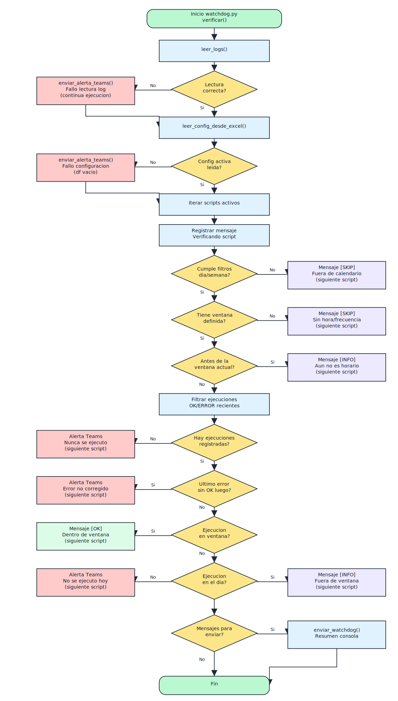

# Watchdog de scripts de alerta

Este proyecto permite monitorear la ejecución periódica de procesos automatizados y mantener un log central en CSV.
La configuración de cada script (ventanas horarias, frecuencia, tolerancias) se define en un archivo Excel simple, para que incluso equipos no técnicos puedan administrarlo.
Cuando detecta incidencias (errores no corregidos, procesos no ejecutados a tiempo o fuera del calendario), envía notificaciones automáticas a Microsoft Teams.

## Requisitos
- Python 3.8 o superior con `pip` disponible (verificar con `py -3 --version`).
- Dependencias de Python listadas en `requirements.txt`. Instalar con:
  ```
  py -3 -m pip install -r requirements.txt
  ```
- Acceso de escritura a la carpeta `Logs/` (se crea automaticamente junto al proyecto) para almacenar `logs_ejecucion.csv`.
- Archivo `config_scripts.xlsx` (hoja `scripts`) con la configuracion de cada proceso.
- Variables de entorno `TEAMS_WEBHOOK_URL` y `TEAMS_WATCHDOG_WEBHOOK_URL` configuradas con los webhooks de Microsoft Teams (no versionarlas ni exponerlas).
- Programador de tareas (por ejemplo, Windows Task Scheduler) para ejecutar tanto los scripts monitoreados como el `watchdog.py` con la frecuencia deseada.

## Configuracion de webhooks
Definir las variables de entorno en el sistema operativo. Ejemplos:

- PowerShell (sesion actual):
  ```powershell
  $env:TEAMS_WEBHOOK_URL = "https://tu-webhook" 
  $env:TEAMS_WATCHDOG_WEBHOOK_URL = "https://tu-webhook-watchdog"
  ```
- PowerShell permanente (usuario actual):
  ```powershell
  setx TEAMS_WEBHOOK_URL "https://tu-webhook"
  setx TEAMS_WATCHDOG_WEBHOOK_URL "https://tu-webhook-watchdog"
  ```

Nunca subas al repositorio los valores reales de estas URLs.

## Componentes principales
- `settings.py`: centraliza rutas relativas (basadas en `Path(__file__).parent`) y la lectura de variables de entorno.
- `logger.py`: utiliza `settings.LOG_FILE` para registrar inicios y cierres en `Logs/logs_ejecucion.csv`.
- `watchdog.py`: lee el log y la configuracion en `config_scripts.xlsx`, evalua ventanas de ejecucion y dispara alertas segun la logica del diagrama.
- `enviar_teams.py` y `enviar_teams_watchdog.py`: envian mensajes a Teams usando las variables de entorno configuradas.


## Diagrama de flujo


## Ejemplo de salida
```
Estado Watchdog
----------------------------------------
Hora de control: 24-09-2025 11:15:32

Verificando script: Script 1
[INFO] Ventana fija: 08:30:00 - 08:45:00
[OK] Ejecutado correctamente dentro de la ventana.

Verificando script: Script 2
[INFO] Ventana frecuencia: 10:00:00 - 10:15:00
[ALERTA] El script "Script 2" tuvo un error el 24-09-2025 09:58:11 y no fue corregido aun.

Verificando script: Script 3
[SKIP] Dia del mes 24 no esta en [1, 8, 15, 22]
```

## ¿Querés adaptarlo a tu entorno o integrarlo con otras herramientas?⚡

Este proyecto es una plantilla básica. Para escenarios corporativos más complejos (redundancia, dashboards en Power BI, integraciones cloud) me podés contactar.